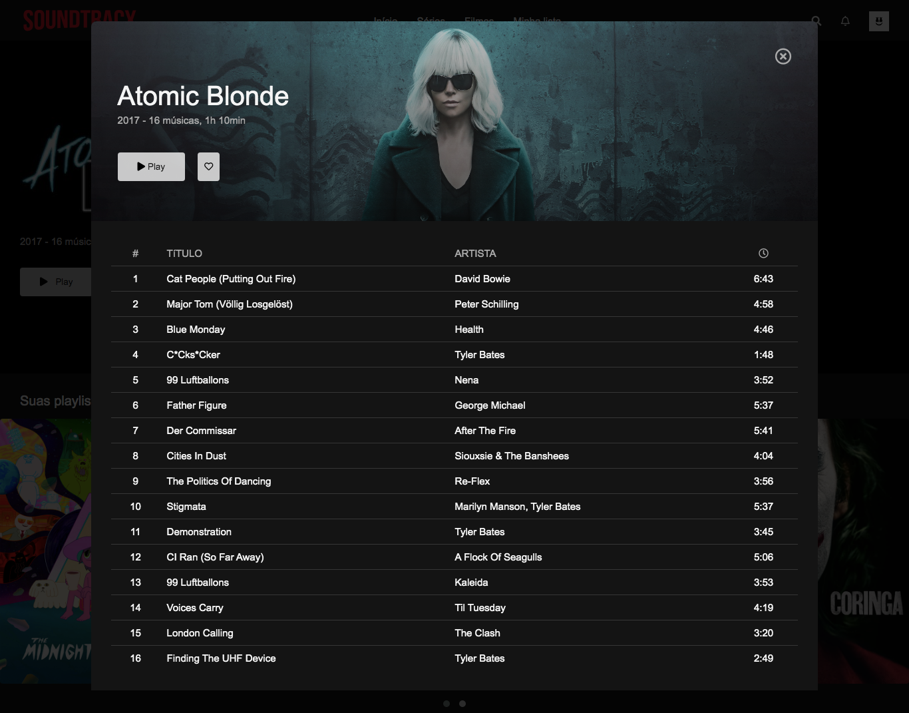
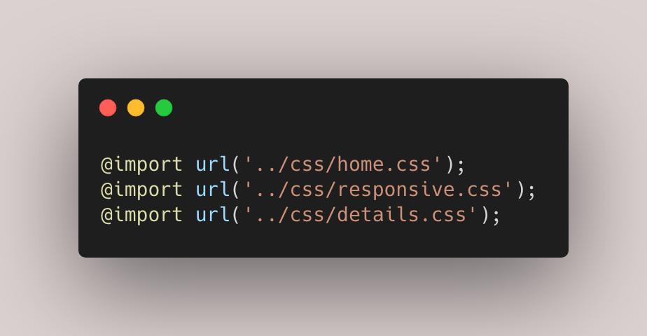
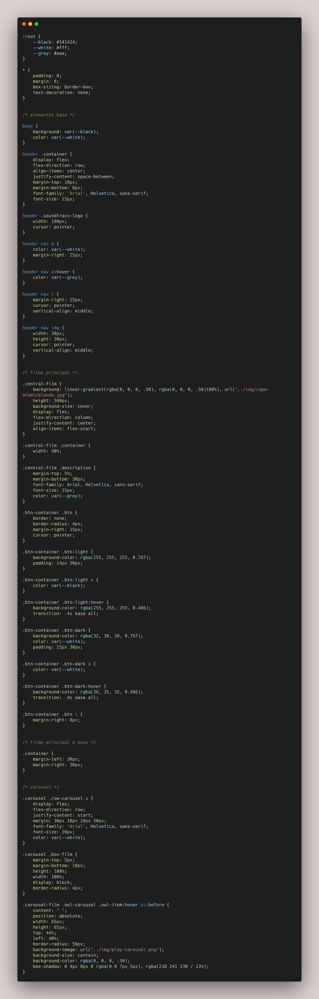
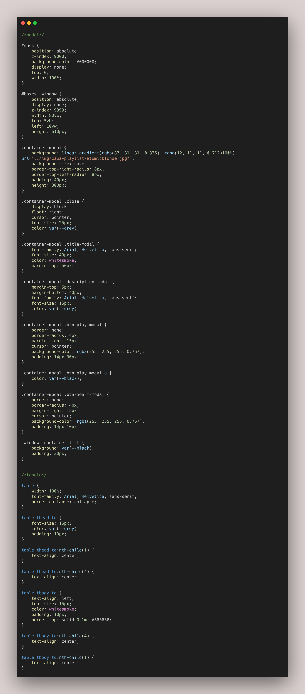
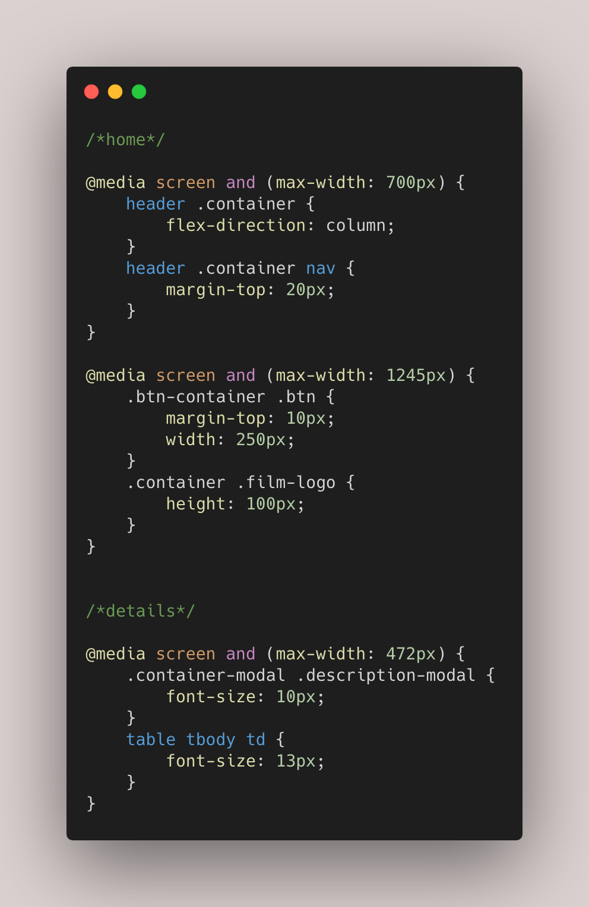
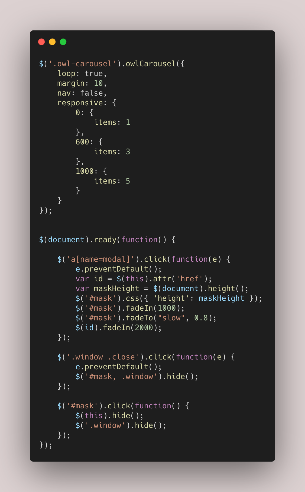

#### _Netflix Interface Clone._

### :rocket: Projeto desenvolvido para participação do Lab "Recriando a interface do Netflix" da Digital Innovation One, mediado por Felipe Aguiar.  

### :warning: Desafio extra proposto no Lab: adicionar nova roupagem ou função ao clone.
### :white_check_mark: Inspirado no layout da Netflix, foi criado o SOUNDTRACX, página de Playlists de trilhas Sonoras, utilizando tecnologias HTML5, CSS3, JavaScript e plugins jQuery. 

#### 🌎 Link para a página: /*[SOUNDTRACX](https://github.com/CarlaBruckmann/netflix-interface-clone/blob/master/Netflix/index.html)*/

[pré-visualização - Home]

[pré-visualização - Details]

[pré-visualização - index.html]

[pré-visualização - styles.css]

[pré-visualização - home.css]

[pré-visualização - details.css]

[pré-visualização - responsive.css]

[pré-visualização - main.js]

